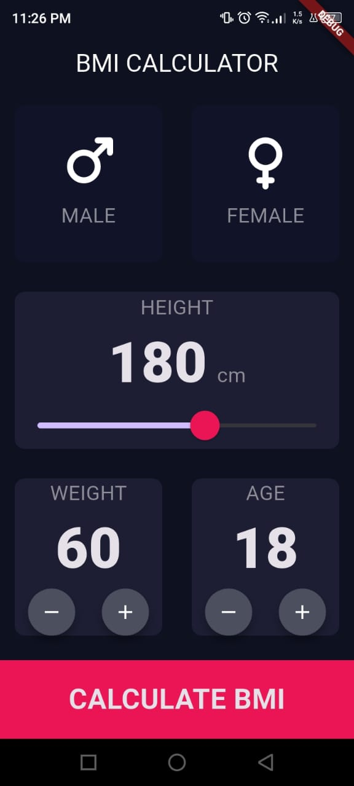
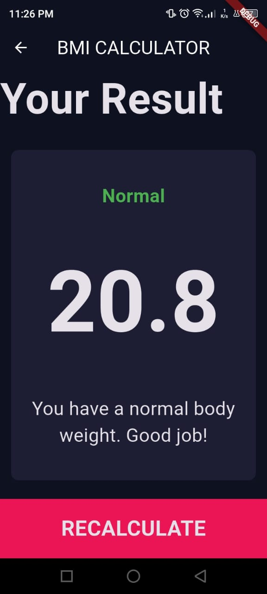
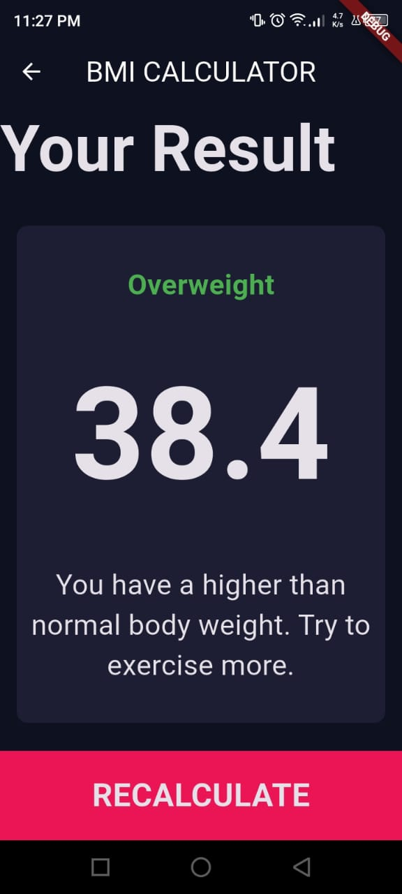
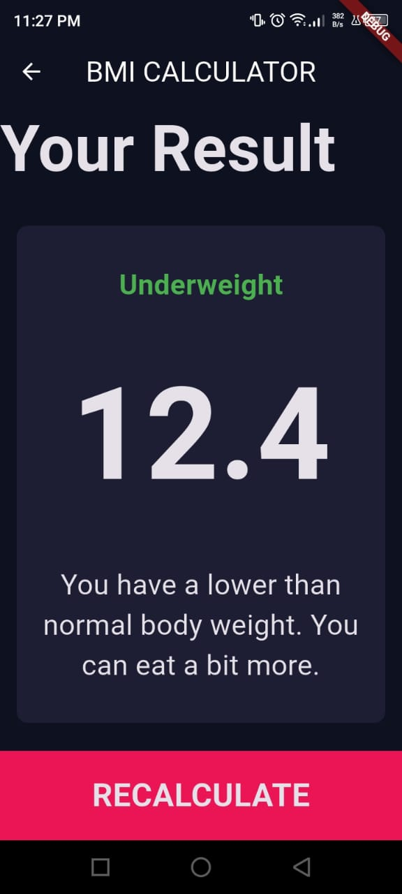

# 🧮 BMI Calculator (Flutter)

A simple and elegant **Body Mass Index (BMI) Calculator** built with **Flutter**.  
This app allows users to calculate their BMI based on height and weight, and displays the corresponding health category with a short interpretation.

---

## 📱 Features

- Select **gender** (Male / Female)
- Adjust **height** using a slider
- Increase or decrease **weight** and **age**
- Calculate BMI instantly
- View:
  - BMI value
  - Result category (Underweight / Normal / Overweight)
  - Health interpretation
- Clean and modern UI
- Dark theme design

---

## 🛠️ Built With

- **Flutter**
- **Dart**
- Material Design widgets
- Custom reusable widgets

---

## 📂 Project Structure

```

lib/
├── main.dart
├── input_page.dart
├── results_page.dart
├── calculator_brain.dart
├── reusable_card.dart
├── reusable_round_icon_button.dart
├── bottom_button.dart
├── icon_content.dart
└── constaints.dart

```

---

## 🧠 How It Works

The BMI is calculated using the standard formula:

```

BMI = weight (kg) / (height (m))²

```

Based on the BMI value, the app categorizes the result as:
- **Underweight**
- **Normal**
- **Overweight**

Each category includes a short health interpretation.

---

## 📸 Screenshots

<p align="center">
  
  
  
  
</p>

## 🚀 Getting Started

### Prerequisites
- Flutter SDK installed
- Android Studio / VS Code
- Android Emulator or physical device

### Run the App
```bash
flutter pub get
flutter run
````

---

## 📚 Learning Goals

This project was built to practice:

* Flutter layout system (`Row`, `Column`, `Expanded`)
* State management with `setState`
* Navigation between screens
* Custom reusable widgets
* Clean UI design

---

## 🤝 Contributing

Contributions, suggestions, and improvements are welcome!
Feel free to fork the project and submit a pull request.

---

## ✨ Author

**Ghofrane BM**
Flutter Developer
📍 Tunisia 🇹🇳

---

## ⭐ Support

If you like this project, feel free to **star ⭐ the repository**
and follow my Flutter learning journey!


